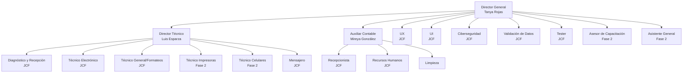

# Organigrama RCOMSII

## Estructura Organizacional

- **Total de personal:** 19 personas
- **Personal con sueldo fijo:** 4 personas (Tanya Rojas, Luis Esparza, Mireya González, Limpieza)
- **Programa JCF:** 15 personas
- **Nómina mensual:** $126,068.00
