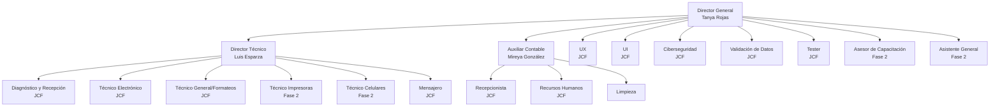

# Organigrama RCOMSII

## Estructura Organizacional

- **Total de personal:** 19 personas
- **Personal con sueldo fijo:** 4 personas (Tanya Rojas, Luis Esparza, Mireya González, Limpieza)
- **Programa JCF:** 15 personas
- **Nómina mensual:** $126,068.00

## ORGANIGRAMA ORGANIZACIONAL

## Resumen de Estructura Organizacional

### **NIVEL DIRECTIVO**
- **Director General:** Tanya Rojas ($35,358/mes)
- **Director Técnico:** Luis Esparza ($30,000/mes) - Coordina todas las áreas técnicas

### **ÁREA ADMINISTRATIVA** (Reportan a Dirección General)
- **Auxiliar Contable:** Mireya González ($20,000/mes)
- **Recepcionista:** JCF
- **Recursos Humanos:** JCF

### **ÁREAS OPERATIVAS** (Reportan a Dirección Técnica)

#### **1. Soporte y Reparaciones (6 personas)**
- Diagnóstico y Recepción (JCF)
- Técnico Electrónica (JCF)
- Técnico General/Formateos (JCF)
- Técnico Impresoras (JCF) - Fase 2
- Técnico Celulares (JCF) - Fase 2
- Mensajero (JCF)

#### **2. TYAKXA - Desarrollo (5 personas)**
- **Diseño:**
  - UX (JCF)
  - UI (JCF)
- **Calidad y Seguridad:**
  - Ciberseguridad (JCF)
  - Validación (JCF)
  - Tester (JCF)

#### **3. Capacitación (1 persona - Fase 2)**
- Asesor/Instructor (JCF)

### **SERVICIOS GENERALES**
- Asistente General (JCF) - Fase 2
- Personal de Limpieza ($10,710/mes)

---

## Datos Clave

- **Total de personal:** 19 personas
- **Personal con sueldo fijo:** 4 personas
- **Programa JCF:** 15 personas
- **Nómina mensual total:** $126,068.00

**Leyenda:**
- JCF = Jóvenes Construyendo el Futuro
- F2 = Fase 2 (contratación posterior)

**Coordinadores:**
1. Tanya Rojas (Director General)
2. Luis Esparza (Director Técnico)
3. Mireya González (Auxiliar Contable)

