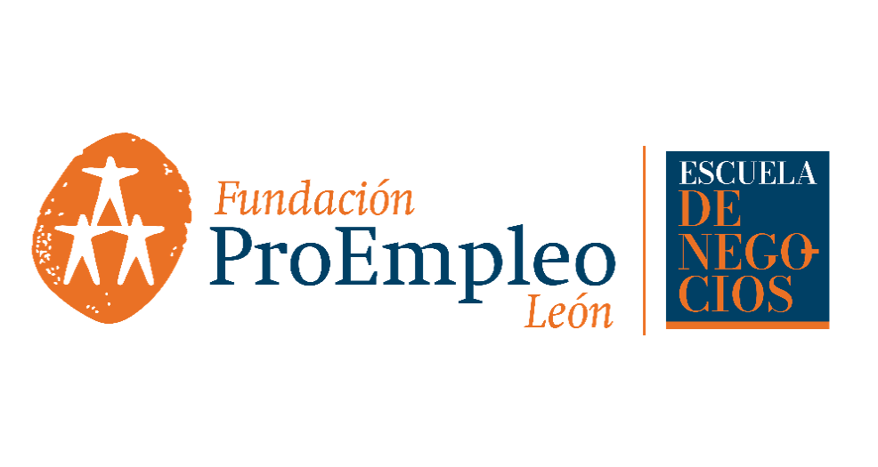

#### PLAN DE NEGOCIO

TORRE DIGITAL

### Soluciones Tecnológicas Integrales
| FASE 1 | FASE 1 | FASE 2 | FASE 2 |
| :---: | :---: | :---: | :---: |
| TYAKXA | NEGOCIOLOCALMX | RCOMSII | LCT |
| Desarrollo de Software | Capacitación a la Medida | Soporte Técnico, Comercializacion y Reparaciones | Marketing Digital |

### Documento Confidencial

---

**Fecha de Elaboración:** Febrero 2026

**Versión:** 1.0

---

## Información de Contacto

**Dirección:**  
POR DEFINIR
León de los Aldama, Gto. 
Mexico

**Teléfono:**  
+52 (477) 411-7910

**Correo Electrónico:**  
contacto@torredigital.mx

**Sitios Web:**  
- www.torredigital.mx
- www.negociolocalmx.com
- www.tyakxa.com
- www.rcomsii.com 
- www.lct.com.mx
---

## Responsable del Plan

**Nombre:**  
MCI. ISC. Tanya Montserrat Rojas González

**Cargo:**  
Fundadora / Directora General

**Contacto:**  
tanya.rojas@torredigital.mx

---

### CONFIDENCIALIDAD

*Este documento contiene información confidencial y de propiedad exclusiva.*  
*Queda prohibida su reproducción, distribución o divulgación sin autorización previa por escrito.*

---

**© 2026 TORRE DIGITAL MX. Todos los derechos reservados.**

---

## Resumen del Modelo de Negocio

**Giros Principales:**
- 🖥️ **Desarrollo de Software a Medida** TYAKXA - (Bueno, Bonito y Barato con IA, I18n, JWT, CI/CD automatizado)
- 🖥️ **Marca complementaria:** NegocioLocalMX - (desarrollo web y marketing digital)
- 🔧 **Soporte Técnico y Reparaciones** RCOMSII - (garantías, mantenimiento, centros autorizados franquiciables)
- 📚 **Capacitación Tecnológica a la Medida** LCT - (contenido personalizado, horarios flexibles, in-situ o en instalaciones)

**Ubicación y Mercado:**
- **Sede Principal:** León, Guanajuato, México
- **Mercado Local:** Empresas y organizaciones en León y zona metropolitana
- **Expansión Regional:** Silao, Irapuato, San Francisco del Rincón, San Felipe
- **Expansión Nacional:** Guadalajara, Monterrey, Ciudad de México
- **Alianzas Educativas:** CBTIS, universidades tecnológicas, AMMJE, SDE
- **Franquicias:** Modelo franquiciable para giro de soporte técnico

**Diferenciadores Clave:**

*Desarrollo:*
- Modelo de desarrollo automatizado basado en IA
- Seguridad y mejores prácticas integradas (I18n, JWT, CI/CD, error catching)
- Equipo eficiente: testers y diseñadores UI/UX (receta secreta de scripts)
- Certificación ISO en seguridad de la información
- Hosting con Hostinger y plan de centros de datos propios

*Soporte y Reparaciones:*
- **Confiabilidad total:** cámaras, espejos de monitoreo, hologramas de seguridad seriados
- Sistema de seguimiento en línea para clientes (diagnósticos y status en tiempo real)
- Soporte a domicilio y en taller
- Competencia directa vs. Plaza de la Tecnología (sin robo de componentes, diagnósticos certeros)
- Centros autorizados de marcas: Dell, Lenovo, HP
- Modelo franquiciable en plazas comerciales

*Capacitación:*
- Contenido 100% personalizado a necesidades del cliente
- Flexibilidad: horarios, ubicación (aula propia o instalaciones del cliente)
- No capacitación genérica, sino soluciones específicas

**Estructura Operativa:**
- 4 giros con manuales de marca independientes en mismo recinto
- 20 personas del programa Jóvenes Construyendo el Futuro
- Colaboración con contadores, ingenieros de producción y administración (comisiones)
- Alianza estratégica con agencia Creatif para marketing
- Financiamiento: préstamos al 8.84% anual

**Visión Internacional:**
- Diseño con I18n desde el inicio
- Estrategia de crecimiento por fases hacia mercados internacionales

---
